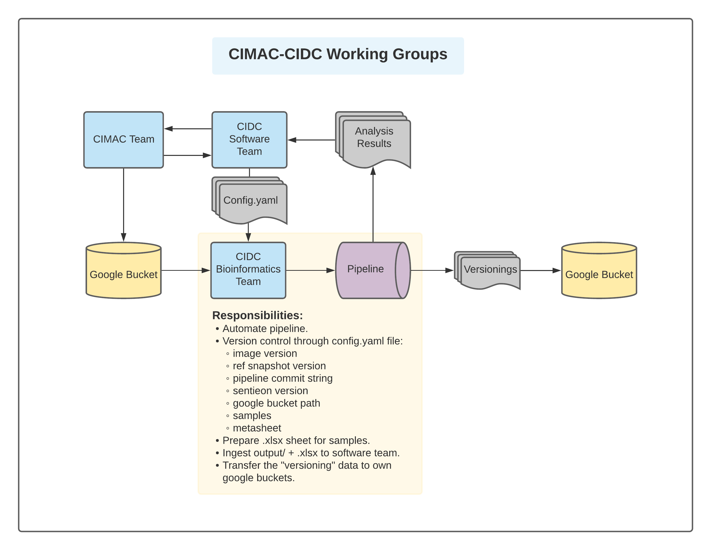

### CIDC Bioinformatics Group Pipeline documentation

This site collects the documentations for running RIMA, CHIPS, WES and TCR-seq.



## How to contribute

1. Fork the git hub repo:https://github.com/crazyhottommy/computation_wiki/

2. Git clone you fork.

2. Under ~/computation_wiki/docs, add markdown file in the corresponding sub-dir.

3. Edit computation_wiki/mkdocs.yml to point the path to the newly added documentations.

4. Commit your changes, git pull and do the pull request.

```bash

git status

git add *

git commit -m "what you've done"

git push origin master
```


```bash
pip install mkdocs

##### Theme #####
## https://squidfunk.github.io/mkdocs-material/
pip install mkdocs-material

#### Extensions ####
### pymdown-extensions ###
## requirements
pip install markdown
pip install pygments
pip install fontawesome_markdown
## install
pip install pymdown-extensions

#### Plugins ####
pip install mkdocs-git-revision-date-plugin
pip install mkdocs-git-revision-date-localized-plugin
pip install mkdocs-minify-plugin
```
